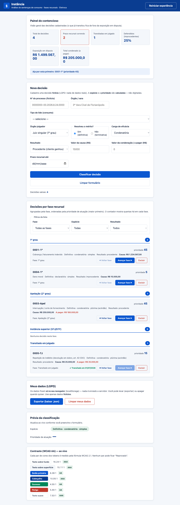

# Instância — análise de sentenças de consumo pelas fases recursais

**Instância** classifica e acompanha as **sentenças/decisões judiciais** da
concessionária de energia **Eletroca** ao longo das **fases recursais**, dizendo,
para cada processo, **que espécie de sentença é**, **em que instância ele está** e
**por qual agir primeiro** (conforme exposição financeira e prazo).

> Projeto didático do experimento **IA na Prática**. Feito com **HTML + CSS +
> JavaScript puros** — abre em qualquer navegador, sem instalar nada, sem servidor
> e sem framework. Todos os dados são **fictícios** (LGPD).



## O conceito (de onde vem a ideia)

A classificação **não é achismo** — vem da lei processual e da doutrina:

- **Espécies de sentença (CPC)** — **terminativa** (sem resolução de mérito, art.
  485) × **definitiva** (com mérito, art. 487); conceito de sentença no art. 203.
  [CPC — Lei 13.105/2015 (Planalto)](http://www.planalto.gov.br/ccivil_03/_ato2015-2018/2015/lei/l13105.htm)
- **Carga de eficácia** — **declaratória / constitutiva / condenatória**
  (classificação ternária de Liebman).
  [Classificação das sentenças (Jusbrasil)](https://www.jusbrasil.com.br/artigos/classificacao-das-sentencas/657105793)
- **Espécie quanto ao órgão** — **simples / plúrima / complexa**.
  [Espécies de sentença (Jusbrasil)](https://www.jusbrasil.com.br/artigos/especies-de-sentenca/121936620)
- **Fases recursais** — apelação, recurso especial (STJ), extraordinário (STF),
  embargos, até o **trânsito em julgado** (CPC, art. 994+).
  [Quadro de recursos (MPCE)](https://mpce.mp.br/institucional/nurc/quadro-de-recursos-no-processo-civil/)
- **Mérito do consumo (ramo Eletroca)** — **CDC (Lei 8.078/1990)** + **REN ANEEL
  nº 1.000/2021** (direitos do consumidor de energia).
  [CDC (Planalto)](http://www.planalto.gov.br/ccivil_03/leis/l8078compilado.htm) ·
  [REN ANEEL 1.000/2021](https://www2.aneel.gov.br/cedoc/ren20211000.html)

Ver `GLOSSARIO.md` para todos os termos em linguagem simples.

## Como funciona

- Cadastre uma **Decisão** (fictícia): nº do processo, órgão, tipo de lide de
  consumo, órgão julgador, se resolveu o mérito, carga, resultado, **valor da
  causa** e **valor da condenação (a pagar)**.
- O app **calcula por função pura** (nunca digitado): a **espécie**
  (terminativa/definitiva · carga · órgão) e a **prioridade de atuação** (cruzando
  valor da causa × resultado × prazo recursal).
- A decisão anda pelo **ciclo de fases recursais** (1º grau → apelação → instância
  superior → transitado; avança e volta um passo). Transitar em julgado **carimba
  a data**; reabrir **limpa**.
- O **Painel do contencioso** resume: total, prazo recursal correndo, transitadas,
  **% de defendidos** (improcedentes), **exposição em disputa** (só o que ainda não
  transitou) e **total condenado (a pagar)**.

## Como rodar

Não precisa instalar nada para usar:

- **Jeito rápido:** abra `index.html` no navegador (duplo clique).
- **Com servidor local** (recomendado, evita restrições de `file://`):
  ```bash
  python3 -m http.server 8000
  # abra http://localhost:8000/index.html
  ```

Os dados ficam no **localStorage** do seu navegador — nada é enviado a servidor.

## Como testar

Requer Node.js (só para rodar os testes).

```bash
npm install                       # Jest, Playwright, ESLint, Prettier, Husky (1ª vez)
npm test                          # testes unitários das regras (Jest)
npx playwright install chromium   # baixa o navegador dos testes E2E (1ª vez)
npm run test:e2e                  # testes de ponta a ponta no navegador (Playwright)
```

Placar atual: **146 testes unitários + 13 E2E**. Todo teste diz no nome se é um caso
`(positivo)` (o que deve funcionar) ou `(negativo)` (o que deve ser bloqueado/dar
erro).

## Qualidade de código (lint, formatação e hook de commit)

```bash
npm run lint      # ESLint: aponta erros e maus hábitos no JavaScript
npm run format    # Prettier: formata o código (--write) num padrão único
npm run prepare   # ativa o Husky (roda sozinho no npm install)
```

O `.husky/pre-commit` descreve o gatilho pretendido (`lint` + `format` + testes).
Os arquivos `.gitignore`, `.eslintignore` e `.prettierignore` deixam
`node_modules/` e artefatos de teste fora do repositório (HTML e `.md` ficam fora
do Prettier, por serem feitos à mão).

> **Nota:** neste experimento o `.git` fica na pasta-raiz (um repositório para os
> três projetos), então o Husky não fixa o hook dentro desta subpasta — rodamos
> `lint`/`format`/`test` a cada etapa. Para hooks ativos, inicialize o Husky na
> raiz do seu próprio repositório.

## Como subir o repositório (passo a passo)

```bash
git init                                         # 1. inicia o repositório (o .gitignore protege o que não sobe)
git add . && git commit -m "primeiro commit"     # 2. primeiro commit
npm install                                      # 3. traz o ferramental e ativa o hook de pre-commit (script prepare)
gh repo create instancia --public --source=. --push   # 4. cria o repo remoto e sobe (ou crie pelo site e git push)
```

## Arquitetura

A ideia central é **separar a regra de negócio (pura e testável) do "mundo
externo" (tela, armazenamento, relógio)**:

| Arquivo | Papel |
|---|---|
| `logica.js` | **Funções puras**: classificação da espécie, prioridade, fases, filtros, resumo do painel, contraste WCAG, exportação. Mesma entrada → mesma saída. Roda no Jest e no navegador. |
| `repositorio.js` | Ponte com o **localStorage** e geração de `id`/data/fase inicial (o não-puro). |
| `app.js` | Liga a tela às funções puras (só apresentação; sem regra de negócio). |
| `index.html` | Telas, **design tokens** (CSS, paleta Jusbrasil) e estrutura. |
| `logica.test.js` | Testes unitários (Jest) das funções puras. |
| `e2e/app.spec.js` | Testes E2E (Playwright) do app real. |

**Por que funções puras?** A espécie e a prioridade são **calculadas**, nunca
digitadas — o que as torna fáceis de testar e à prova de erro humano. As funções
que dependem de tempo (prazo, trânsito, "hoje") recebem a data **de fora**, para
continuarem puras.

## Acessibilidade (WCAG AA)

- **Relatório de contraste ao vivo** no rodapé: cada par de cores é medido por
  funções puras (`luminancia`, `razaoContraste`, `nivelWcag`) e classificado
  (AA/AAA). Um teste "guarda" reprova qualquer cor que quebre o AA.
- Teclado, foco visível, `aria-label` nos botões repetidos, `fieldset/legend` nos
  grupos e labels ligados aos campos.
- **Espaçamento garantido por teste** (`validarEspacamento`): elementos colados ou
  sobrepostos reprovam.

## Inspiração visual

Paleta e estilo derivados do **Jusbrasil** (maior portal jurídico do Brasil) —
azul institucional `#0B57D0`, navy `#0A3D91` e verde `#00875A`. Todas as cores
foram medidas: passam no **contraste WCAG AA** (a estética não fura a
acessibilidade).

## Privacidade (LGPD)

O dado é seu: as decisões ficam **só no seu navegador**; você pode **exportar**
(baixar `.json`) ou **limpar** tudo quando quiser. **Todos os exemplos usam dados
fictícios** — nunca números de processo, partes ou valores reais.

## Estrutura de arquivos

```
analise-de-sentencas-recursais/
├── index.html          # tela + design tokens (paleta Jusbrasil)
├── logica.js           # regras puras (espécie, prioridade, fases, filtros, resumo, contraste)
├── repositorio.js      # localStorage + id/data/fase inicial
├── app.js              # liga a tela às regras
├── logica.test.js      # testes unitários (Jest)
├── e2e/app.spec.js     # testes E2E (Playwright)
├── playwright.config.js
├── CLAUDE.md           # instruções do projeto para a IA
├── PROMPTS.md          # diário de prompts (Setup 0 → 13)
├── GLOSSARIO.md        # termos em linguagem simples
├── RESUMAO.md          # memorial de cada etapa
├── PLANO-DE-TESTES.md  # próximos testes (cobertura + features candidatas)
└── slides.html         # apresentação da história do projeto
```

## Documentos do projeto

- **`PROMPTS.md`** — o caminho inteiro, prompt a prompt (Setup 0 → entregas).
- **`RESUMAO.md`** — o que foi feito, decisões e aprendizados por etapa.
- **`GLOSSARIO.md`** — todos os termos explicados com analogias.
- **`PLANO-DE-TESTES.md`** — próximos passos: cobertura a reforçar + features
  candidatas, com o esboço dos testes.
- **`slides.html`** — abra no navegador para a apresentação.
