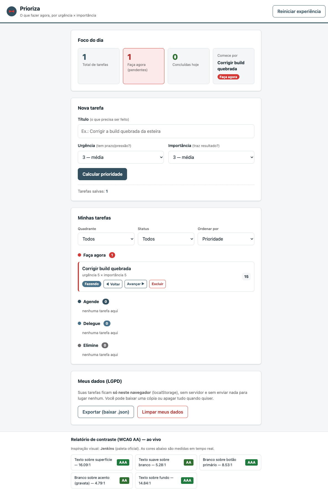

# Prioriza — organizador de tarefas por urgência × importância

**Prioriza** é um organizador de tarefas que, em vez de só listar o que você tem
para fazer, **calcula qual tarefa começar agora** cruzando **urgência ×
importância** (a Matriz de Eisenhower) e mostra esse foco num painel.

> Projeto didático do experimento **IA na Prática**. Feito com **HTML + CSS +
> JavaScript puros** — abre em qualquer navegador, sem instalar nada, sem
> servidor e sem framework.



## O conceito (de onde vem a ideia)

A priorização **não é achismo** — vem de métodos consagrados:

- **Matriz de Eisenhower** (urgente × importante, 4 quadrantes): popularizada por
  Dwight D. Eisenhower e formalizada por Stephen Covey.
  [Asana](https://asana.com/resources/eisenhower-matrix) ·
  [Quote Investigator](https://quoteinvestigator.com/2014/05/09/urgent/)
- **GTD (Getting Things Done)** de David Allen — capturar tudo fora da cabeça.
  [gettingthingsdone.com](https://gettingthingsdone.com/)
- **MoSCoW** de Dai Clegg — classificar o essencial (Must/Should/Could/Won't).
  [Wikipedia](https://en.wikipedia.org/wiki/MoSCoW_method)

Os quatro quadrantes, em português: **Faça agora** (urgente e importante),
**Agende** (importante, não urgente), **Delegue** (urgente, não importante) e
**Elimine** (nem um nem outro). Ver `GLOSSARIO.md` para todos os termos.

## Como rodar

Não precisa instalar nada para usar:

- **Jeito rápido:** abra o arquivo `index.html` no navegador (duplo clique).
- **Com servidor local** (recomendado, evita restrições de `file://`):
  ```bash
  python3 -m http.server 8000
  # abra http://localhost:8000/index.html
  ```

Os dados ficam no **localStorage** do seu navegador — nada é enviado para
servidor nenhum.

## Como testar

Requer Node.js (só para rodar os testes).

```bash
npm install          # instala Jest e Playwright (só na 1ª vez)
npm test             # testes unitários das regras (Jest)
npx playwright install chromium   # baixa o navegador dos testes E2E (1ª vez)
npm run test:e2e     # testes de ponta a ponta no navegador (Playwright)
```

Placar atual: **82 testes unitários + 4 E2E**. Todo teste diz no nome se é um
caso `(positivo)` (o que deve funcionar) ou `(negativo)` (o que deve ser
bloqueado/dar erro).

## Arquitetura

A ideia central é **separar a regra de negócio (pura e testável) do "mundo
externo" (tela, armazenamento, relógio)**:

| Arquivo | Papel |
|---|---|
| `logica.js` | **Funções puras**: priorização (Eisenhower), status, filtros, contraste WCAG, exportação. Mesma entrada → mesma saída. Roda no Jest e no navegador. |
| `repositorio.js` | Ponte com o **localStorage** e geração de `id`/data (o não-puro). |
| `app.js` | Liga a tela às funções puras (só apresentação; sem regra de negócio). |
| `index.html` | Telas, **design tokens** (CSS) e estrutura. |
| `logica.test.js` | Testes unitários (Jest) das funções puras. |
| `e2e/app.spec.js` | Testes E2E (Playwright) do app real. |

**Por que funções puras?** A prioridade e o quadrante são **calculados**, nunca
digitados — o que os torna fáceis de testar e à prova de erro humano. As funções
que dependem de tempo (concluir, "hoje") recebem a data **de fora**, para
continuarem puras.

## Acessibilidade (WCAG AA)

- **Relatório de contraste ao vivo** no rodapé: cada par de cores é medido por
  funções puras (`luminancia`, `razaoContraste`, `nivelWcag`) e classificado
  (AA/AAA). Um teste "guarda" reprova qualquer cor que quebre o AA.
- Teclado, foco visível, `aria-label` nos botões repetidos e labels ligados aos
  campos.

## Inspiração visual

Paleta e estilo derivados do **Jenkins** (o mordomo do CI/CD) — Worn Navy, Medium
Carmine (a gravata), Bismark. Curiosidade: o **carmim oficial `#D33834` passa no
contraste AA** (4.79:1 com texto branco), então foi mantido autêntico — a
estética não fura a acessibilidade.

## Privacidade (LGPD)

O dado é seu: as tarefas ficam **só no seu navegador**, você pode **exportar**
(baixar `.json`) ou **limpar** tudo quando quiser. Exemplos usam dados fictícios.

## Estrutura de arquivos

```
organizador-tarefas-prioridades/
├── index.html          # tela + design tokens (paleta Jenkins)
├── logica.js           # regras puras (priorização, status, filtros, contraste)
├── repositorio.js      # localStorage + id/data
├── app.js              # liga a tela às regras
├── logica.test.js      # testes unitários (Jest)
├── e2e/app.spec.js     # testes E2E (Playwright)
├── playwright.config.js
├── CLAUDE.md           # instruções do projeto para a IA
├── PROMPTS.md          # diário de prompts (Setup 0 → 12)
├── GLOSSARIO.md        # termos em linguagem simples
├── RESUMAO.md          # memorial de cada etapa
└── slides.html         # apresentação da história do projeto
```

## Documentos do projeto

- **`PROMPTS.md`** — o caminho inteiro, prompt a prompt (Setup 0 → entregas).
- **`RESUMAO.md`** — o que foi feito, decisões e aprendizados por etapa.
- **`GLOSSARIO.md`** — todos os termos explicados com analogias.
- **`slides.html`** — abra no navegador para a apresentação.
